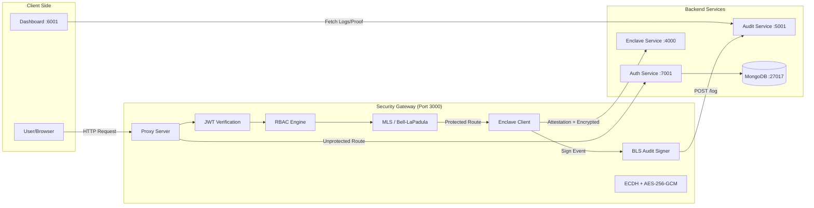
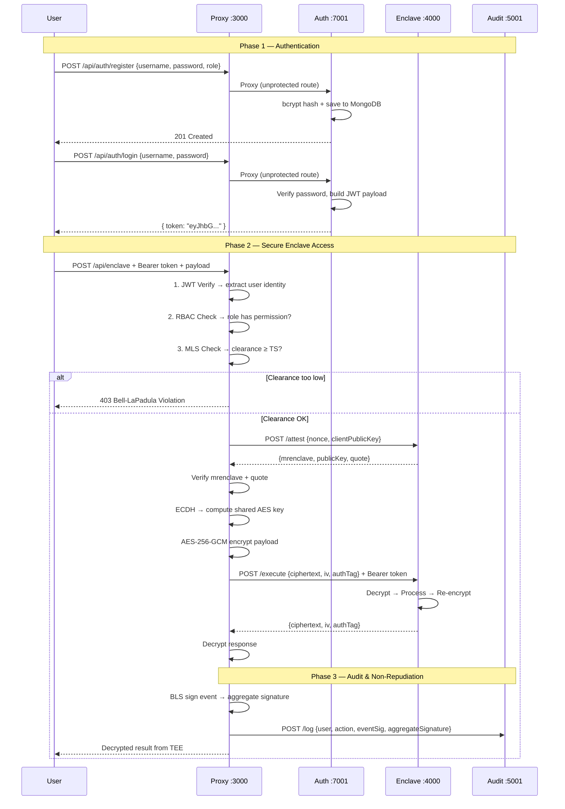

# Security Gateway SDK — Full Project Walkthrough

## What This Project Is

This is a **Security Gateway SDK** — a microservices-based middleware system designed as a **course project** to demonstrate secure communication between two untrusted parties over a network. It implements military-grade security concepts and is built as an **npm workspace monorepo** using Node.js/Express.

The core premise:
- **Party A (Client):** The Auth Service, acting on behalf of a user.
- **Party B (Backend):** A simulated Trusted Execution Environment (Enclave).
- **The Proxy:** A middleware sitting between them, enforcing all security properties.

---

## Architecture Overview



### Port Map

| Service | Port | Purpose |
|:--------|:-----|:--------|
| **Proxy** | 3000 | Main Security Gateway — all client requests enter here |
| **Enclave** | 4000 | Simulated TEE (Intel SGX / ARM CCA) |
| **Audit** | 5001 | Immutable audit log storage + BLS verification |
| **Dashboard** | 6001 | React/Vite real-time monitoring UI |
| **Auth** | 7001 | User registration, login, JWT issuance |
| **Swagger Docs** | 8000 | API documentation |

---

## Module-by-Module Breakdown

### 1. Proxy — The Core SDK (`/proxy`)

This is the heart of the project — a **publishable, project-agnostic SDK** that any Express app can mount as middleware.

#### [index.js](file:///c:/fl/Security-gateway/proxy/index.js) — `SecurityGateway()` Factory

The main export. It takes a configuration object and returns an Express router with security middleware dynamically wired per route:

```
SecurityGateway({
  jwtSecret, routes, rbacPolicies, mlsLattice
}) → Express.Router
```

For each route in the config:
- **Unprotected routes** (e.g., `/auth`): Simply proxied via `http-proxy-middleware` to the target backend.
- **Protected routes** (e.g., `/enclave`): A middleware chain is assembled:
  1. `verifyToken` → JWT authentication
  2. `rbacMiddleware` → Role-based access control check
  3. `createMLSMiddleware` → Bell-LaPadula clearance check
  4. If `useSecureChannel: true` → An `EnclaveClient` performs attestation + ECDH key exchange + AES-GCM encrypted execution, and a `BLSAuditSim` signs the event and POSTs it to the Audit service.

#### [server.js](file:///c:/fl/Security-gateway/proxy/server.js) — Standalone Gateway Server

A thin Express wrapper that loads `gateway-config.json` from disk (or `GATEWAY_CONFIG_PATH` env var) and mounts the SDK at `/api`. This makes the proxy project-agnostic — no hard imports of `../config`.

---

### 2. Security Middleware (`/proxy/middleware/`)

#### [security.js](file:///c:/fl/Security-gateway/proxy/middleware/security.js) — JWT Verification

- Extracts `Bearer <token>` from the `Authorization` header.
- Verifies the JWT signature using the injected secret.
- Attaches the decoded payload to `req.user` (contains `sub`, `username`, `role`, `clearance`, `resources`, `actions`).
- Injects identity into downstream headers: `x-user-id`, `x-user-role`, `x-user-clearance`.

#### [mls.js](file:///c:/fl/Security-gateway/proxy/middleware/mls.js) — Bell-LaPadula (Multi-Level Security)

Implements the classic military security lattice model:

| Level | Code | Weight |
|:------|:-----|:-------|
| Unclassified | `U` | 10 |
| Confidential | `C` | 20 |
| Secret | `S` | 30 |
| Top Secret | `TS` | 40 |

Two core rules enforced:
1. **No-Read-Up (Simple Security):** A `GET` request is blocked if the user's clearance is *lower* than the route's required clearance. (e.g., a `C`-level user cannot read `TS` data).
2. **No-Write-Down (*-Property):** A `POST`/`PUT` is blocked if the user's clearance is *higher* than the route's required clearance. (e.g., a `TS`-level user cannot write data to a `U` endpoint — prevents data spillage).

#### [rbac.js](file:///c:/fl/Security-gateway/proxy/middleware/rbac.js) — Role-Based Access Control

Enforces two checks against the policy matrix:
1. **Action Check:** Is the user's role allowed to perform this HTTP method? (e.g., `guest` can only `GET`).
2. **Resource Check:** Does the request path match any allowed resource glob? (e.g., `user` role can access `/data/*` and `/reports/*`, but not `/admin/*`).

Policy matrix example:
```json
{
  "admin": { "resources": ["*"], "actions": ["GET","POST","PUT","DELETE","PATCH"], "mlsMin": "TS" },
  "user":  { "resources": ["/data/*", "/reports/*"], "actions": ["GET","POST"], "mlsMin": "S" },
  "guest": { "resources": ["/public/*"], "actions": ["GET"], "mlsMin": "U" }
}
```

---

### 3. Cryptography Library (`/proxy/lib/`)

#### [crypto.js](file:///c:/fl/Security-gateway/proxy/lib/crypto.js) — `SecureChannel` Class

Provides **Confidentiality** and **Integrity**:

1. **Key Exchange:** Uses ECDH on the `secp256k1` curve. Each side generates a key pair, shares the public key, and computes a shared secret. This gives **Perfect Forward Secrecy**.
2. **Encryption:** The shared secret is SHA-256 hashed into a 32-byte AES key. Payloads are encrypted with **AES-256-GCM** (Authenticated Encryption with Associated Data).
3. **Integrity:** GCM mode produces an `authTag`. If a Man-in-the-Middle tampers with the ciphertext in transit, decryption will throw an error.

Output envelope format:
```json
{ "ciphertext": "...", "iv": "...", "authTag": "..." }
```

#### [enclave-client.js](file:///c:/fl/Security-gateway/proxy/lib/enclave-client.js) — `EnclaveClient` Class

The secure intermediary between the Proxy and the TEE. The full handshake flow:

1. **Attestation:** Sends a random `nonce` + the Proxy's ECDH public key to `POST /attest` on the Enclave.
2. **mrenclave Verification:** Checks that the Enclave's returned hardware hash matches the expected value (prevents server spoofing).
3. **Quote Verification:** Recomputes the HMAC-based quote locally and compares it (simulated hardware signature).
4. **ECDH Handshake:** Computes the shared AES key using the Enclave's verified public key.
5. **Execution:** Encrypts the payload, sends to `POST /execute`, decrypts the encrypted response.
6. **Auto-retry:** If the Enclave restarts and loses its session, the client detects "Shared secret not computed" and re-attests automatically.

Also supports `seal` (encrypt & store inside TEE) and `unseal` (retrieve & decrypt) operations.

#### [bls.js](file:///c:/fl/Security-gateway/proxy/lib/bls.js) — `BLSAuditSim` Class

Simulates **BLS12-381 Aggregate Signatures** for non-repudiation:

- Each gateway event is HMAC-SHA256 signed with a private key → `eventSig`.
- The event signature is combined with the running aggregate signature via SHA-256 hashing → `aggregateSignature`.
- N events produce a single constant-size proof. If any entry is deleted or modified, the chain breaks.

> [!NOTE]
> Real BLS pairing math requires heavy WASM libraries. This simulates the aggregation property with chained hashes for the course project.

---

### 4. Auth Service (`/auth`)

A full Express + MongoDB authentication service.

#### [User.js](file:///c:/fl/Security-gateway/auth/model/User.js) — Mongoose Schema

```
{ username: String (unique), password: String, role: enum[admin|user|guest], clearanceLevel: String }
```

#### [UserController.js](file:///c:/fl/Security-gateway/auth/controller/UserController.js)

| Endpoint | Function | Description |
|:---------|:---------|:------------|
| `POST /register` | `register` | Hashes password with bcrypt, maps role → clearance level (`admin→TS`, `user→S`, `guest→U`), saves to MongoDB |
| `POST /login` | `login` | Verifies password, issues JWT containing `sub`, `username`, `role`, `clearance`, `resources`, `actions` |
| `GET /me` | `getMe` | Returns the decoded JWT payload (requires auth) |
| `GET /test-enclave` | `checkEnclaveAccess` | Auth backend acts as a client, pings the Enclave directly with the user's token to test connectivity |
| `GET /test-mls` | `simulateMls` | Same but specifically tests Bell-LaPadula blocking (expects 403 for low-clearance users) |

#### [AuthMiddleware.js](file:///c:/fl/Security-gateway/auth/middleware/AuthMiddleware.js)

A local JWT verification middleware used for the Auth service's own protected routes (like `/me`). Separate from the SDK's `createSecurityMiddleware`.

#### [auth/index.js](file:///c:/fl/Security-gateway/auth/index.js)

The Auth service *also* mounts the `SecurityGateway` SDK itself (at `/api`), creating a secondary gateway entry point at port 7001. This means the Auth service doubles as both an authentication backend and a gateway.

---

### 5. Enclave Service (`/enclave`)

Simulates a **Trusted Execution Environment** (Intel SGX / ARM CCA). It self-protects by mounting the SDK's own `verifyToken` and `mlsShield` middleware.

#### Endpoints

| Endpoint | Method | Description |
|:---------|:-------|:------------|
| `/attest` | POST | Receives client's nonce + public key, computes ECDH shared secret, returns `mrenclave` hash + enclave public key + HMAC quote |
| `/execute` | POST | Receives AES-GCM encrypted payload, decrypts inside TEE, processes, re-encrypts response |
| `/seal` | POST | Receives encrypted data, decrypts, stores in memory (simulating hardware sealing) |
| `/unseal` | POST | Retrieves sealed data by label, encrypts it, returns to client |
| `/` | GET | Simple health check (requires `TS` clearance) |

---

### 6. Audit Service (`/audit`)

An immutable audit log store that receives BLS-signed events from the Proxy.

#### Endpoints

| Endpoint | Method | Description |
|:---------|:-------|:------------|
| `/log` | POST | Receives a signed log entry, stores it, updates the aggregate proof |
| `/logs` | GET | Returns all stored log entries |
| `/proof` | GET | Returns the current aggregate BLS signature and entry count |
| `/verify` | GET | Recomputes the entire signature chain from scratch and checks if it matches the stored aggregate — detects tampering |

---

### 7. Dashboard (`/dashboard`)

A **React + Vite** real-time monitoring UI that:

- **Polls the Audit service** every 5 seconds for logs, proof, and verification status.
- **Displays status cards:** Aggregate proof hash, integrity status (PASSED/FAILED), Enclave online status, violation count.
- **Live audit log table:** Shows timestamp, user, resource, action, clearance badge, and proof index for each event.
- **Security Console (Terminal):** An interactive console that shows step-by-step simulation output.
- **Request Simulator:** A dropdown to select a role (`admin`/`user`/`guest`) and a button that performs a full end-to-end flow:
  1. Registers a random user via the Gateway
  2. Logs in to obtain a JWT
  3. Calls the Enclave via the Gateway
  4. Shows whether access was granted or Bell-LaPadula blocked it

---

### 8. Configuration (`/config`)

#### [config/index.js](file:///c:/fl/Security-gateway/config/index.js)

Central configuration exporting port mappings, JWT settings, the MLS lattice weights, RBAC policy matrix, and simulated hardware values (`mrenclave`, BLS private key).

#### [config/sdk-resolver.js](file:///c:/fl/Security-gateway/config/sdk-resolver.js)

A smart module loader that switches between:
- `USE_LOCAL_SDK=true` → loads `../proxy` directly (development mode)
- `USE_LOCAL_SDK=false` → loads `secure-gateway-sdk` from npm (production mode)

#### [gateway-config.json](file:///c:/fl/Security-gateway/gateway-config.json)

The standalone proxy's route configuration — defines the `/auth` (unprotected) and `/enclave` (protected, TS clearance, secure channel) routes.

---

## End-to-End Request Flow

Here's what happens when a user sends a request to the protected Enclave route:



---

## Security Properties Achieved

| CIA Property | Mechanism | Implementation File |
|:-------------|:----------|:-------------------|
| **Authentication** | JWT (HMAC-SHA256 signed tokens) | [security.js](file:///c:/fl/Security-gateway/proxy/middleware/security.js) |
| **Authorization** | Bell-LaPadula MLS + RBAC policies | [mls.js](file:///c:/fl/Security-gateway/proxy/middleware/mls.js), [rbac.js](file:///c:/fl/Security-gateway/proxy/middleware/rbac.js) |
| **Confidentiality** | ECDH key exchange + AES-256-GCM encryption | [crypto.js](file:///c:/fl/Security-gateway/proxy/lib/crypto.js) |
| **Integrity** | AES-GCM authentication tags | [crypto.js](file:///c:/fl/Security-gateway/proxy/lib/crypto.js) |
| **Non-Repudiation** | BLS aggregate signatures on audit logs | [bls.js](file:///c:/fl/Security-gateway/proxy/lib/bls.js) |
| **Service Auth** | Enclave attestation (mrenclave + quote verification) | [enclave-client.js](file:///c:/fl/Security-gateway/proxy/lib/enclave-client.js) |

---

## File Tree Summary

```
Security-gateway/
├── package.json              # NPM workspace root (concurrently runs all services)
├── gateway-config.json       # Standalone proxy route definitions
├── docker-compose.yml        # MongoDB container
├── swagger.json              # OpenAPI 3.0 spec
├── swagger-server.js         # Swagger UI Express server (:8000)
├── .env.example              # Environment variable template
│
├── config/
│   ├── index.js              # Central config (ports, JWT, MLS lattice, RBAC, enclave, BLS)
│   ├── sdk-resolver.js       # Switches between local SDK and npm package
│   └── gateway-routes.json   # Alternative route config for Auth service
│
├── proxy/                    # ★ THE CORE SDK ★
│   ├── index.js              # SecurityGateway() factory — the main export
│   ├── server.js             # Standalone Express server wrapping the SDK
│   ├── middleware/
│   │   ├── security.js       # JWT verification middleware
│   │   ├── mls.js            # Bell-LaPadula lattice enforcement
│   │   └── rbac.js           # Role-based access control enforcement
│   └── lib/
│       ├── crypto.js         # SecureChannel: ECDH + AES-256-GCM
│       ├── enclave-client.js # EnclaveClient: attestation + secure execution
│       └── bls.js            # BLSAuditSim: aggregate signature simulation
│
├── auth/                     # Authentication Microservice
│   ├── index.js              # Express app + MongoDB + mounts SDK
│   ├── controller/
│   │   └── UserController.js # register, login, getMe, test-enclave, test-mls
│   ├── middleware/
│   │   └── AuthMiddleware.js # Local JWT verification for /me route
│   ├── model/
│   │   └── User.js           # Mongoose schema (username, password, role, clearance)
│   └── router/
│       └── UserRoute.js      # Express route definitions
│
├── enclave/                  # Simulated TEE Microservice
│   └── index.js              # /attest, /execute, /seal, /unseal endpoints
│
├── audit/                    # Immutable Audit Log Service
│   └── index.js              # /log, /logs, /proof, /verify endpoints
│
└── dashboard/                # React Monitoring UI
    ├── vite.config.js
    └── src/
        ├── App.jsx           # Main dashboard: logs table, proof display, request simulator
        ├── index.css          # Dashboard styling
        └── main.jsx          # React entry point
```
